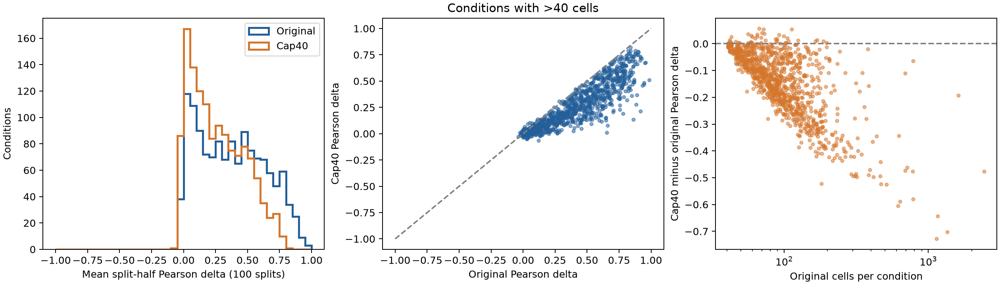

# Jurkat cap40 下采样分析结果

**训练扰动细胞减少62.7%，实测拆半 Pearson Δ 从0.3739降至0.2618。**
cap40保留所有训练条件，但降低条件均值的重复性；结果不能推断模型性能下降多少。
本次只生成和分析衍生数据，没有开始训练，也没有切换B0默认数据。

[双栏中文PDF报告](data/jurkat-cap40-5a8a7bb-20260930T094437Z/report.zh.pdf) | [完整图数据索引](data/jurkat-cap40-5a8a7bb-20260930T094437Z/artifact-index.json)

## 采样与数据验收

| 项目 | 原始 | cap40 |
|---|---:|---:|
| 训练扰动细胞 | 128,266 | 47,836 |
| 训练扰动条件 | 1,335 | 1,335 |
| control细胞 | 12,013 | 12,013 |
| 验证扰动细胞 | 41,235 | 41,235 |
| 测试扰动细胞 | 54,658 | 54,658 |
| 其他排除行 | 2,805 | 2,805 |
| H5AD总行数 | 238,977 | 158,547 |
| 基因变量数 | 6,506 | 6,506 |

只有训练扰动条件被无放回采样，每条件 min(40,Np)，seed42；batch按比例分配名额，
最大余数法补齐。原始表达、所有保留行/基因身份、obs/var分类字典均精确保持。
原H5AD与四份冻结manifest哈希前后不变；成功运行exit0、COMPLETE、zero-PKL。
主会话另行核对全部保留行集合和顺序、分区、每条件样本数、元数据与267,000条逐次统计。

317个原有细胞数≤40的条件完全不变，1018个条件被下采样。
**866个条件失去至少一个原batch的细胞覆盖**：40个名额不能总给稀有batch分到一行。
这是本次实际观察，不是完全保留batch的协议。后续模型实验须考虑条件权重与batch覆盖同时变化。

## 100次分层拆半对比

对每个条件先均分其细胞为互不重叠的两组，再比较两组平均表达的相关性；每个batch及整体
两侧行数之差≤1，随机处理奇数余行。重复100次，先在条件内平均，再对条件等权平均。
两版本都减去原条件batch上下文中的同一完整control池均值，基因轴固定5000。
这不是模型预测评估的300-control输入，也不改变已有测试协议。

| 指标 | 原始 | cap40 |
|---|---:|---:|
| 拆半Pearson Δ，条件均值 | 0.3739 | 0.2618 |
| 拆半Pearson Δ，条件中位数 | 0.3644 | 0.2229 |
| 不减control的表达Pearson，条件均值 | 0.9732 | 0.9630 |
| 有效条件数 | 1331 | 1331 |

cap40−原始的条件配对差均值为 **−0.1122**；条件bootstrap的95%描述区间
为[−0.1188,−0.1058]（1000次）。四个单细胞条件 BIRC5、RACGAP1、ECT2、SEC13
无法拆成两组，记缺失而不是0。这是同一固定cap40样本的100次拆半，未重复生成100份cap40。
它衡量观察到的重复性，不是理论Pearson上限或独立生物重复的置信区间。
共同control参考的噪声也可能影响相关性；这不是完全无噪声的真实扰动效应估计。



图1左：分布向较低重复性移动；中：大多数受影响条件在相等线下方；右：
原条件细胞越多，压到40后损失通常越大。按细胞数分层的数字如下：

| 原条件细胞数 | 条件数 | 有效条件 | 原始Pearson Δ | cap40 | 差值 |
|---|---:|---:|---:|---:|---:|
| 1-40 | 317 | 313 | 0.2687 | 0.2687 | +0.0000 |
| 41-80 | 411 | 411 | 0.3704 | 0.3022 | -0.0682 |
| 81-160 | 452 | 452 | 0.4028 | 0.2384 | -0.1644 |
| >160 | 155 | 155 | 0.5117 | 0.2089 | -0.3028 |

分层数字不构成跨条件因果分析：条件效应强弱和batch数等也随条件变化。
但同一条件原/采样配对结果明确显示，较强限幅会降低均值稳定性。

## 保留效应及代价

受影响1018个条件中，保留40行与完整原条件均值的Pearson Δ平均为 **0.7991**，
保留40行与被删除行均值的Pearson Δ平均为 **0.3736**。第一种有样本重叠，
数值明显偏乐观，不能用0.7991宣称保留了同等重复性；第二种样本互不重叠。
二者样本量不同于20对20的cap40拆半，亦不能直接当作同一个估计量。

总表达Pearson仍很高（0.9630），但扰动变化重复性降低，说明高基础表达相关性
不能代替扰动效应稳定性。训练行数变为原来的37.3%，同batch训练步数可近似减少62.7%；
原验证/测试和control均保留，总时长不会据此必然减少62.7%。还没有cap40模型训练结果。
`row_mean`未改；以后采用此样本训练时，条件总权重因细胞数改变，需如实记录。

cap40适合作为待验证的较小训练数据版本。本次分析不能认定它与原数据等质量，
也没有足够证据将它直接设为新的训练默认。现阶段完成数据与统计交付。

## 产物、复现与来源

实际分析耗时90.85秒，CPU-only、4个数值线程。成功源码
`5a8a7bb6712bc4facdfeb13d8dd629bd0f250880`；配置SHA256
`1e692732fca3fad57a713ada9475be71a9bce785563d7a5d1b53ec01850cb80f`。
H5AD衍生文件SHA256 `9cb901ead750d82f96cf85016e409b863643e340c043ff8c3aef48d5e48ef98b`，
状态是分析衍生数据，不冒充canonical_ready。
服务器运行根为 `/data/yilangliu/GraD-Pert/development/jurkat-cap40-5a8a7bb-20260930T094437Z`。

| 产物 | 内容／位置 |
|---|---|
| cap40.h5ad | 158547×6506，4.143GB，仅在服务器 |
| selection.json | 固定训练采样行ID、条件清单、身份哈希，2.72MB，仅在服务器 |
| repeat_scores.csv | 267000条条件×版本×拆半统计，16.84MB，仅在服务器 |
| [conditions.json](data/jurkat-cap40-5a8a7bb-20260930T094437Z/conditions.json) | 全部逐条件统计，也是图1的全部作图数据 |
| [summary.json](data/jurkat-cap40-5a8a7bb-20260930T094437Z/summary.json) | 汇总、分层、版本、原始哈希与保留值校验 |
| [comparison.pdf](data/jurkat-cap40-5a8a7bb-20260930T094437Z/comparison.pdf) | 图1矢量PDF；PNG同目录 |
| [artifact-index.json](data/jurkat-cap40-5a8a7bb-20260930T094437Z/artifact-index.json) | 所有实际分析产物大小和SHA256索引 |
| [验收收据](data/jurkat-cap40-5a8a7bb-20260930T094437Z/jurkat-cap40-5a8a7bb-20260930T094437Z-acceptance.json) | 主会话独立验收与缺失条件／batch覆盖计数 |
| receipt.json、COMPLETE.json、launch、exit、tests、publication | 同目录小型版本和终态证据 |

方法、精确命令、采样公式及失败修复记录见
[协议](JURKAT_CAP40_REPRODUCIBILITY_20260930.md)。首轮身份校验、第二轮分类字典检查
失败均保留原目录；未放宽断言、未覆盖旧run，最后本地/服务器定向检查均8项通过。

借鉴[TxPert实验重复性基线](https://github.com/valence-labs/TxPert/tree/08d82eea86746b044cf7531f4ec8c5f60e1cb73f#experimental-reproducibility)
的真实子集与未使用细胞比较思想。本次分层100次拆半是项目适配，
不声称原样复现其官方实验，也不是raw-count multinomial采样模式。

报告PDF使用已物化的小型结果与图生成，2页双栏，包含可点击的图1、逐条件数据及TxPert来源。
两页均经过渲染检查；PDF内容及链接检查通过。可在装有reportlab且可读取中文字体的本地环境复现：

```bash
python scripts/analysis/render_cap40_report.py \
  --results docs/experiments/data/jurkat-cap40-5a8a7bb-20260930T094437Z \
  --output output/pdf/jurkat-cap40-analysis-zh.pdf \
  --font '/System/Library/Fonts/Supplemental/Arial Unicode.ttf'
```

该renderer仅用于本次冻结结果，不接受其他源码身份的结果，以免固定报告文案被误用于新实验。
