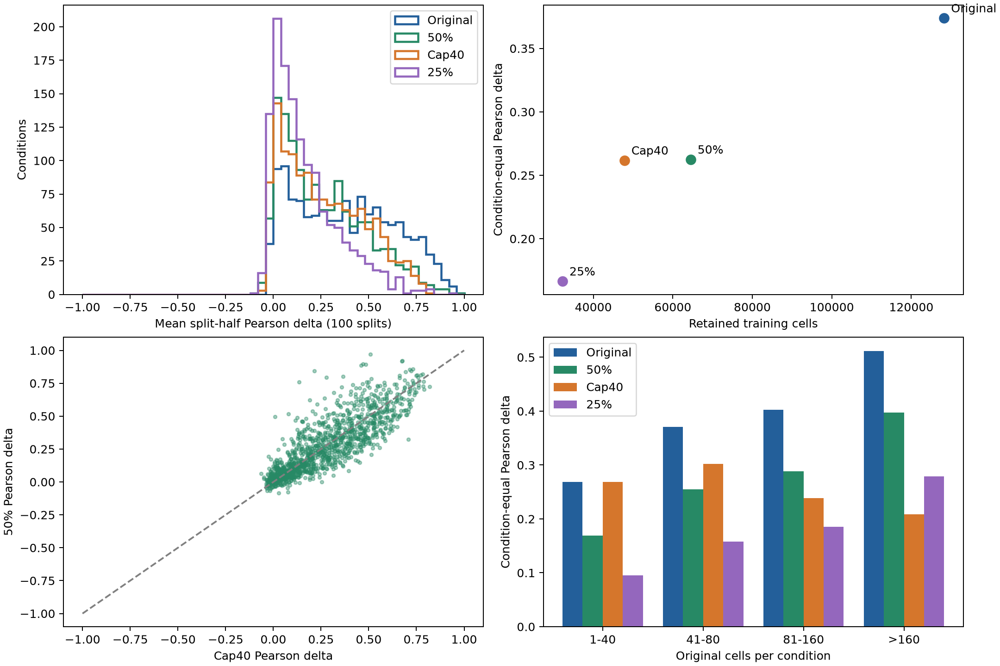

# Jurkat 三种下采样与原数据的比较

**50%和cap40的整体拆半Pearson Δ接近；25%下降明显。** 50%与cap40分别保留64475和47836个训练细胞，但它们在不同规模的扰动条件中表现相反，不能仅凭总体平均认定一种训练方案更好。本次只分析数据，未启动模型训练、切换默认数据或改动既有评估协议。

[双栏中文PDF](data/jurkat-sampling-comparison-8638c65-20260930T103836Z/report.zh.pdf) · [图1矢量PDF](data/jurkat-sampling-comparison-8638c65-20260930T103836Z/comparison.pdf) · [图1全部作图数据](data/jurkat-sampling-comparison-8638c65-20260930T103836Z/conditions.json) · [所有图、数据及版本索引](data/jurkat-sampling-comparison-8638c65-20260930T103836Z/artifact-index.json)

## 样本量与主要结果

| 版本 | 训练扰动细胞 | 减少比例 | 拆半Pearson Δ均值 | Δ中位数 | 总表达Pearson均值 |
|---|---:|---:|---:|---:|---:|
| 原始 | 128,266 | 0% | 0.3739 | 0.3644 | 0.9732 |
| 每条件最多40 | 47,836 | 62.71% | 0.2618 | 0.2229 | 0.9630 |
| 每条件50% | 64,475 | 49.73% | 0.2625 | 0.2206 | 0.9518 |
| 每条件25% | 32,246 | 74.86% | 0.1665 | 0.1172 | 0.9161 |

所有版本保留1335个训练扰动条件、12013个control、41235个验证扰动细胞、54658个测试扰动细胞、2805个其他排除行及6506个变量。两种比例衍生H5AD分别为175186×6506、142957×6506。所有保留行表达值和obs/var元数据精确不变；训练外110711行均保留原身份与顺序。

统计使用冻结的5000个表达基因。1331个条件有有效拆半结果，四个单细胞条件BIRC5+ctrl、RACGAP1+ctrl、ECT2+ctrl、SEC13+ctrl无法拆半，记缺失而非0。



图1左上是条件内100次拆半相关性均值的分布；右上显示训练行数与条件等权均值；左下逐条件比较50%和cap40；右下按原细胞数分层。作图数据和全部原始汇总在上方链接，所有统计图均在服务器物化。

## 为什么50%细胞更多，但总体分数接近cap40？

| 原条件细胞数 | 条件数 | 原始 | cap40 | 50% | 25% |
|---|---:|---:|---:|---:|---:|
| 1-40 | 317 | 0.2687 | 0.2687 | 0.1689 | 0.0954 |
| 41-80 | 411 | 0.3704 | 0.3022 | 0.2547 | 0.1579 |
| 81-160 | 452 | 0.4028 | 0.2384 | 0.2882 | 0.1850 |
| >160 | 155 | 0.5117 | 0.2089 | 0.3973 | 0.2785 |

原条件≤40时，cap40不删除任何细胞，50%/25%却仍然缩小这些条件；原条件>160时，比例采样通常比40行保留更多细胞，50%的重复性显著更高（此处“更高”描述数值，不是新增显著性检验）。当前汇总对条件等权，大条件多出的细胞不会使其在统计中权重更大。因此总体均值接近并不代表两个样本等价。

从本次**数据重复性与训练数据量**两个指标看，cap40以更少训练行得到接近50%的总体重复性；50%较好保留大条件信息，且近似保留原row_mean条件权重。小条件的最低2行与整数取整会偏离严格比例。实际模型性能和训练速度尚未测量，不能据此直接指定训练默认。

## 定义与统一口径

比例f∈{0.5,0.25}，条件p原有n_p行，采用半入取整：

\[
m_p=\min\{n_p,\max[\min(n_p,2),\lfloor f n_p+0.5\rfloor]\}.
\]

按原batch比例分配m_p个名额，最大余数法补齐，并使用固定seed42无放回抽样；n_p=1仍保留1，n_p≥2至少保留2。每种方法只生成一份固定样本，未重新采样100份数据。cap40仍是此前冻结结果，不重写历史协议。

对版本v、条件p与重复k，拆成不重叠A/B，每个batch及整个条件两侧数量差≤1，奇数余行随机分侧：

\[
r_{p,k}^{(v)}=\operatorname{corr}_g
(\bar x_{p,A_k}^{(v)}-\mu_{c,p},\bar x_{p,B_k}^{(v)}-\mu_{c,p}),
\quad r_p^{(v)}=\frac1{100}\sum_{k=1}^{100}r_{p,k}^{(v)}.
\]

再对有效条件r_p等权平均。所有版本减同一份**原条件完整batch上下文中的control池均值**，不是预测评估的300-control输入。原始H5AD/split/四份manifest、基因轴、control向量内容哈希、原始拆半assignment哈希一致；原始逐条件分数以绝对误差≤10⁻¹³核对。新/旧源码差异仅为采样参数扩展，历史cap40未覆盖。

共同control参考的噪声也会影响相关性；单次种子的结果不能概括全部采样不确定性。这是观测到的表达变化重复性，不是理论模型Pearson上限。

## 配对下降、代表性和batch覆盖

| 版本 | 与原始的配对均值差 | 条件bootstrap 95%描述区间 |
|---|---:|---|
| 每条件最多40 | -0.1122 | [-0.1188, -0.1058] |
| 每条件50% | -0.1114 | [-0.1150, -0.1076] |
| 每条件25% | -0.2075 | [-0.2138, -0.2008] |

1000次条件bootstrap的区间描述条件分布，不是独立生物重复置信区间，也未对50%与cap40开展另一个显著性检验。

| 版本 | 受采样影响条件 | 丢失≥1个原batch的条件 | 保留/完整Pearson Δ | 保留/删除Pearson Δ |
|---|---:|---:|---:|---:|
| 每条件最多40 | 1018 | 866 | 0.7991 | 0.3736 |
| 每条件50% | 1329 | 1309 | 0.8289 | 0.3741 |
| 每条件25% | 1329 | 1319 | 0.6632 | 0.3393 |

两种辅助Pearson仅汇总受影响条件；cap40与比例版本的条件集合不同，不能视为完全配对。保留/完整包含重叠细胞，偏乐观；保留/删除不重叠，但两侧样本量不等于拆半。最大余数比例分配不能保证所有稀有batch都分到一行。比例采样仍损失batch覆盖，不能宣称batch完全保持。

## 完整产物及可复现身份

新分析/比较干净源码：`8638c6557d779ed2290a00b0882964597ca81d3b`；本地、GitHub和服务器身份已核对。12项本地及服务器测试通过。CPU-only、4个数值线程，50%耗时89.42秒，25%耗时82.55秒，包含导出和严格数据校验；顺序队列约180.40秒。队列/两个分析exit0，jurkat-sampling-comparison-8638c65-20260930T103836ZLETE和全部输出hash通过；独立主会话校验全部行、配额、metadata和各267000条CSV。成功根均zero-PKL，Luna监督已结束，没有新训练或定时监控。

| 版本 | 完整源码SHA | 配置SHA256及收据 |
|---|---|---|
| 每条件最多40 | `5a8a7bb6712bc4facdfeb13d8dd629bd0f250880` | [1e692732fca3fad57a713ada9475be71a9bce785563d7a5d1b53ec01850cb80f](data/jurkat-cap40-5a8a7bb-20260930T094437Z/receipt.json) |
| 每条件50% | `8638c6557d779ed2290a00b0882964597ca81d3b` | [93201429299fb0bf8345f62d2adcb14f0286a5572526bd935672084b86367584](data/jurkat-proportion50-8638c65-20260930T103836Z/receipt.json) |
| 每条件25% | `8638c6557d779ed2290a00b0882964597ca81d3b` | [7d4cb61931b6aa4094abe8b8bfe9d5f64ec5a3717068d8cc87f190931a9da0aa](data/jurkat-proportion25-8638c65-20260930T103836Z/receipt.json) |

服务器目录：`/data/yilangliu/GraD-Pert/development/`，具体根见sources.json与索引。大文件只留服务器；两个新衍生数据仍标为`analysis_derivative_not_canonical_ready`。

| 版本 | 本地小型统计、全部图与收据 |
|---|---|
| 每条件最多40 | [summary.json](data/jurkat-cap40-5a8a7bb-20260930T094437Z/summary.json) · [conditions.json](data/jurkat-cap40-5a8a7bb-20260930T094437Z/conditions.json) · [comparison.png](data/jurkat-cap40-5a8a7bb-20260930T094437Z/comparison.png) · [comparison.pdf](data/jurkat-cap40-5a8a7bb-20260930T094437Z/comparison.pdf) · [receipt.json](data/jurkat-cap40-5a8a7bb-20260930T094437Z/receipt.json) · [COMPLETE.json](data/jurkat-cap40-5a8a7bb-20260930T094437Z/COMPLETE.json) |
| 每条件50% | [summary.json](data/jurkat-proportion50-8638c65-20260930T103836Z/summary.json) · [conditions.json](data/jurkat-proportion50-8638c65-20260930T103836Z/conditions.json) · [comparison.png](data/jurkat-proportion50-8638c65-20260930T103836Z/comparison.png) · [comparison.pdf](data/jurkat-proportion50-8638c65-20260930T103836Z/comparison.pdf) · [receipt.json](data/jurkat-proportion50-8638c65-20260930T103836Z/receipt.json) · [COMPLETE.json](data/jurkat-proportion50-8638c65-20260930T103836Z/COMPLETE.json) |
| 每条件25% | [summary.json](data/jurkat-proportion25-8638c65-20260930T103836Z/summary.json) · [conditions.json](data/jurkat-proportion25-8638c65-20260930T103836Z/conditions.json) · [comparison.png](data/jurkat-proportion25-8638c65-20260930T103836Z/comparison.png) · [comparison.pdf](data/jurkat-proportion25-8638c65-20260930T103836Z/comparison.pdf) · [receipt.json](data/jurkat-proportion25-8638c65-20260930T103836Z/receipt.json) · [COMPLETE.json](data/jurkat-proportion25-8638c65-20260930T103836Z/COMPLETE.json) |

| 版本 | 服务器专属文件 | 字节数 | SHA256 |
|---|---|---:|---|
| 每条件最多40 | cap40.h5ad | 4,142,763,987 | `9cb901ead750d82f96cf85016e409b863643e340c043ff8c3aef48d5e48ef98b` |
| 每条件最多40 | repeat_scores.csv | 16,841,325 | `7d41d1e25bbb1111019c19de595257e4d8c17114911ef088aefaa2c703674c97` |
| 每条件最多40 | selection.json | 2,723,219 | `a609d5aa4087d209dc62c1e8ed70dc7cff89ed6952b2afb18d0972cb477c94f2` |
| 每条件50% | proportion50.h5ad | 4,577,325,950 | `60b09901ce7a9645d047bbe98df9ebff3431a5c832967cab86809dbba80aa912` |
| 每条件50% | repeat_scores.csv | 16,842,687 | `110175f42494545643a1ffb7b43b4784af4d0f5f9d03eddd1920a5ff6bc00f6b` |
| 每条件50% | selection.json | 3,649,611 | `7908e955ced277c0a2e7185996e420118d08dd943aec1ee20e67f73b0742dadd` |
| 每条件25% | proportion25.h5ad | 3,735,601,325 | `8919420b0052065f65095327019b49ef4fac44f2452e6a48f18d0df37a55ac99` |
| 每条件25% | repeat_scores.csv | 16,858,573 | `5a3ea88462a52e8b0146ad3a107ba3bb03965759aa04ccd0a2ce18ac69fc7dd1` |
| 每条件25% | selection.json | 1,855,336 | `059c1ae46db53fbd18be9d0d3042e10ea5b98185a9c8e4b9b6686440401794aa` |

四版本新增产物：

- `sources.json`：三个采样版本的完整来源、摘要和身份，原数据参照包含其中。
- `conditions.json`：1335条件的原始与三个采样版本，图1的全部逐条件数据。
- `comparison.png`和`comparison.pdf`：同一四面板图，PDF为矢量图。
- `jurkat-sampling-comparison-8638c65-20260930T103836ZLETE.json`：比较源码与所有统计/图的hash。
- `artifact-index.json`：上述产物、三个分析run的每个科学文件大小/hash及本地文件清单。
- `small-transfer.json`：24个小文件合计4217452字节的审核/传输清单，每个已核对hash；无H5AD、行ID清单或逐次CSV下载。
- 队列`.plan.json/.publication.json/.exit.json/.acceptance.json`及`tests.json`：启动、发布、12项检查、终态与独立验收。
- `report.zh.pdf`：本地用小型结果渲染的两页双栏中文报告，含图/数据/论文/源码链接。PDF已逐页渲染检查。

复现分析（用新的输出目录，CPU-only4线程，已发布干净源码）：

```bash
PYTHONPATH=src:. OMP_NUM_THREADS=4 OPENBLAS_NUM_THREADS=4 MKL_NUM_THREADS=4 \
CUDA_VISIBLE_DEVICES='' python scripts/analysis/train_downsample_reproducibility.py \
  --data-root /data/yilangliu/GraD-Pert/data --output /data/yilangliu/new-proportion50 \
  --fraction 0.5 --seed 42 --repeats 100
```

25%将fraction改为0.25；输出目录不可覆盖。比较脚本`compare_train_sampling.py`接三份完成run并先核对身份；统计record保留历史`cap_*`键，含义是“该run采样版本”，fraction/method已明确写入summary/selection/receipt。

复现PDF：`render_sampling_report.py --results <小型比较目录> --output <报告.pdf>`，需reportlab与支持中文的字体，不重新计算科学统计。

沿用[前一cap40协议](JURKAT_CAP40_REPRODUCIBILITY_20260930.md)和[结果](JURKAT_CAP40_RESULT_20260930.md)。原讨论提出的另外两种采样确为50%/25%，本次没有增加其他数据集。
借鉴[TxPert真实子集重复性分析](https://github.com/valence-labs/TxPert/tree/08d82eea86746b044cf7531f4ec8c5f60e1cb73f#experimental-reproducibility)的思想；100次分层拆半及条件等权汇总是项目适配，不声称官方原样复现，也不是raw-count multinomial采样模式。
