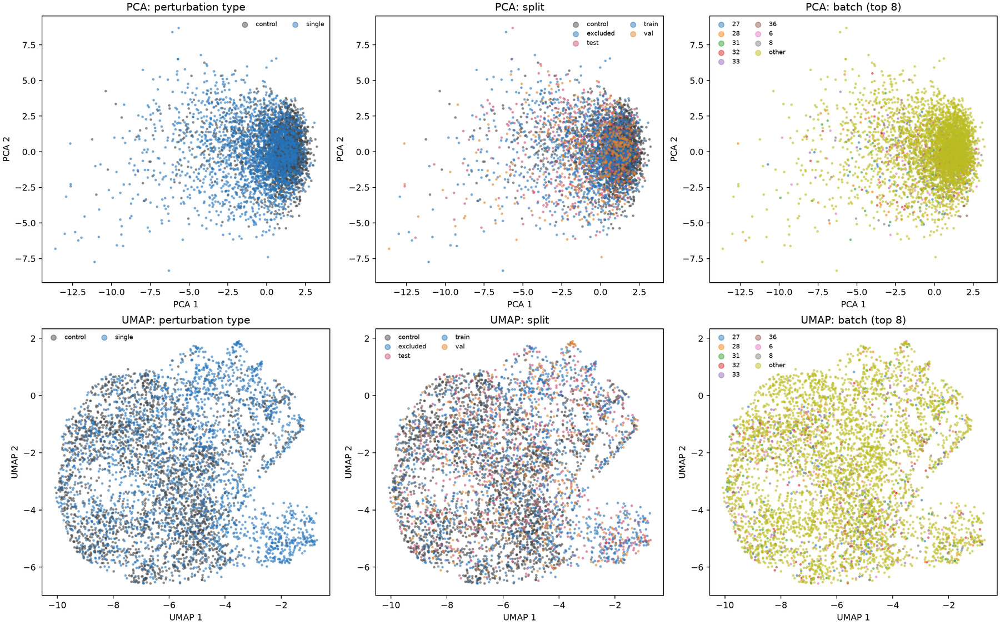
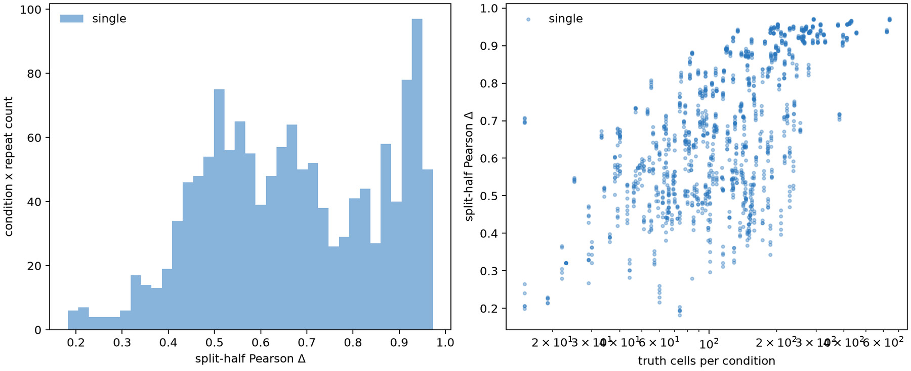
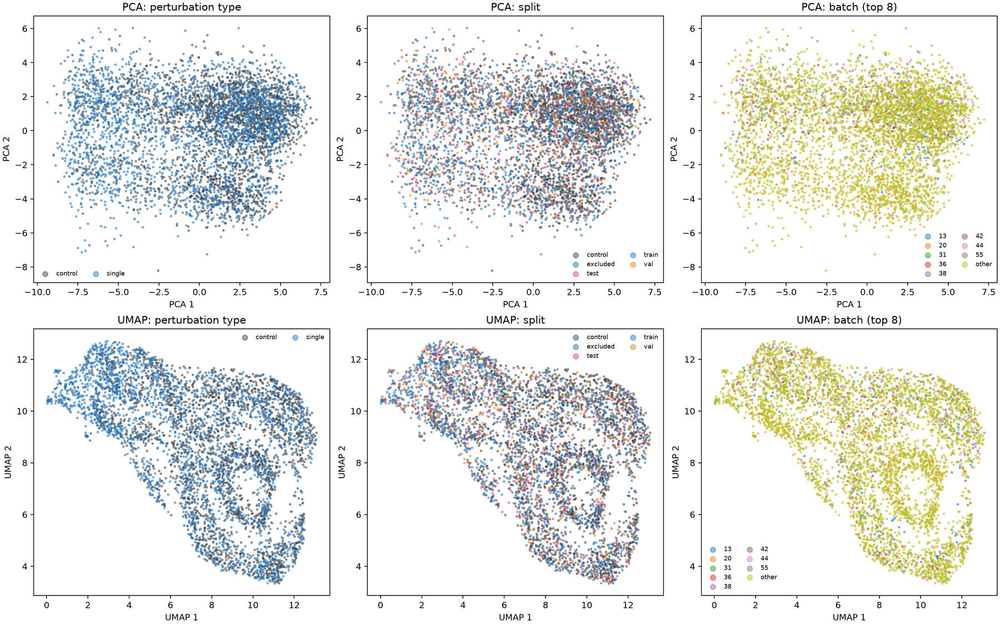
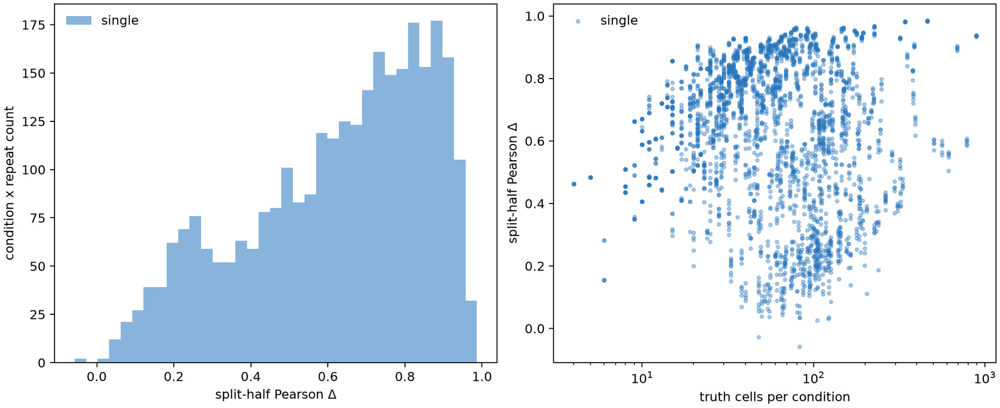
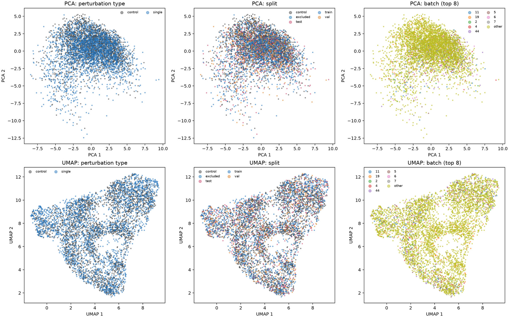
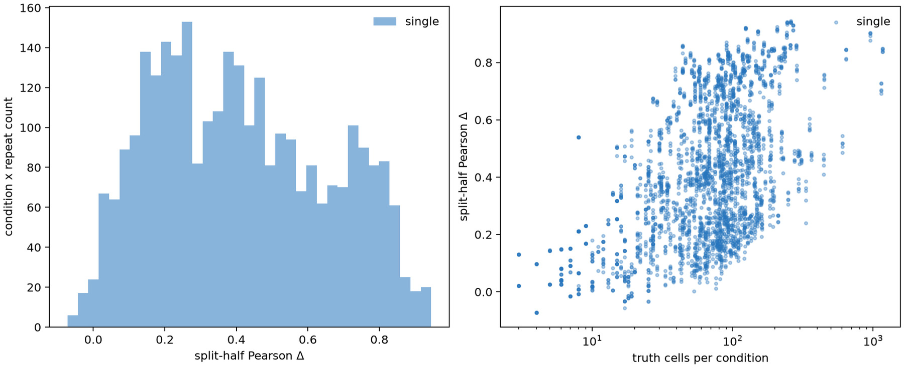
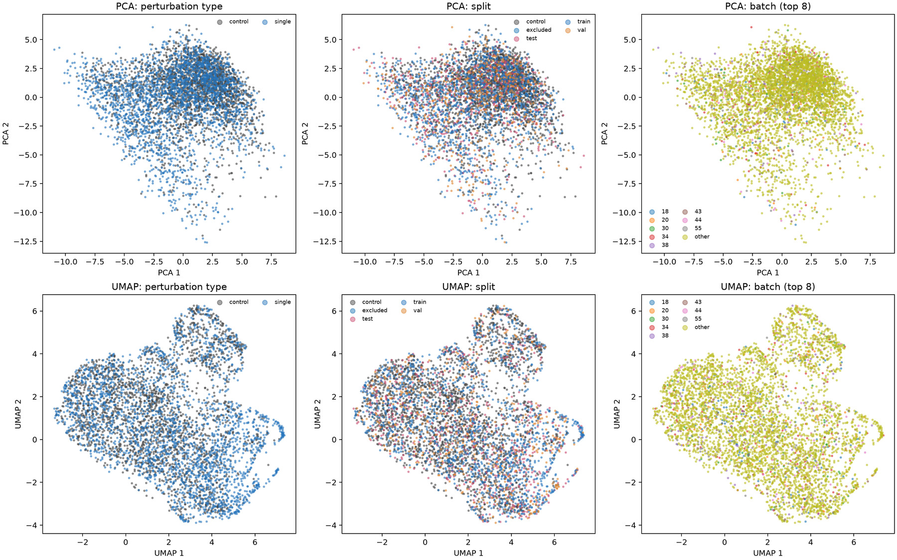
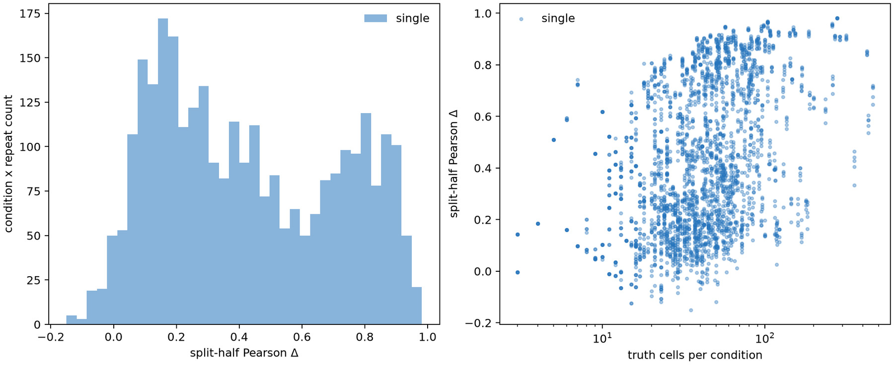
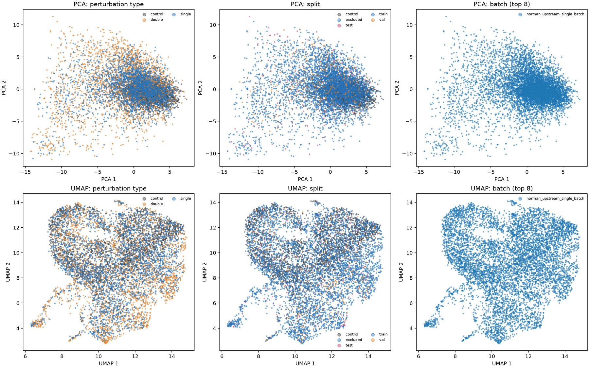
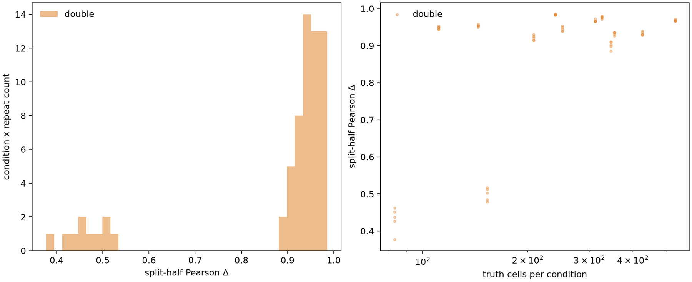

# 数据附录：全部图与聚合统计

本附录补齐本轮五项观察性分析实际生成的全部 12 张图，以及其聚合数值。图 A1-A10 为五个独立数据集各自的 PCA/UMAP 和条件拆半图；正文图 1-2 为景观图与跨细胞热图。后续表格按数据来源分别列出统计量，不把固定轴缓存当作独立基准。逐条件 JSON 包含数千条记录，仍保存在服务器收据所列目录，未压成不可读的 PDF 表格。

聚合源文件：`docs/experiments/data/report-aggregate-current-ecdf8f1.json`；SHA256 `d1ff95b33688b75d38c3e477b971aa65ebbbc9792171be1080fd7872729a334f`。同一 JSON 也内嵌在 PDF 附件中。它由五项完成的服务器运行导出，只移除了逐条件明细和每批次 control 计数；各运行收据哈希写在源文件的 `sources` 字段。图 A1-A10 是原始分析 PNG 的等内容、印刷分辨率 JPEG 副本。

## A. EDA：细胞组成、PCA 与测试集拆半

| 数据集 | 批次数 | control／单／双细胞 | 前两 PC 方差比 | 表达基因 |
| --- | --- | --- | --- | --- |
| Replogle K562 | 48 | 10,691/150,971/0 | 0.043 | 5000 |
| Replogle RPE1 | 56 | 11,485/218,759/0 | 0.092 | 5000 |
| Nadig Jurkat | 55 | 12,013/226,964/0 | 0.051 | 5000 |
| Nadig HepG2 | 56 | 4,976/125,903/0 | 0.095 | 5000 |
| Norman | 1 | 7,353/48,407/35,445 | 0.083 | 5045 |

| 数据集 | 条件×重复数 | 效应 r 中位 | 效应 r P05／P95 | 表达 r 中位 |
| --- | --- | --- | --- | --- |
| Replogle K562 | 1365 | 0.662 | 0.378/0.946 | 0.995 |
| Replogle RPE1 | 2950 | 0.670 | 0.186/0.926 | 0.987 |
| Nadig Jurkat | 2950 | 0.390 | 0.064/0.821 | 0.986 |
| Nadig HepG2 | 2955 | 0.387 | 0.044/0.893 | 0.981 |
| Norman | 65 | 0.944 | 0.454/0.982 | 0.998 |

这两表对应图 A1-A10；拆半仅在冻结测试条件计算，重复五次。Norman 用双扰动条件，其他四项用单扰动条件。前两 PC 方差是可视化抽样的描述，不用于模型评价。

## B. 景观：批次、响应与检索

| 数据来源 | 标签-批次关联 | 置换基线 | 超额关联 | 同批 control r | 跨批 control r |
| --- | --- | --- | --- | --- | --- |
| Replogle K562 | 0.0493 | 0.0488 | 0.0005 | 0.9977 | 0.9963 |
| Replogle RPE1 | 0.0822 | 0.0803 | 0.0019 | 0.9962 | 0.9943 |
| Nadig Jurkat | 0.0768 | 0.0762 | 0.0006 | 0.9959 | 0.9932 |
| Nadig HepG2 | 0.1369 | 0.1334 | 0.0035 | 0.9920 | 0.9915 |
| Norman | NA | NA | NA | 0.9999 | NA |
| 固定轴 K562 | 0.0493 | 0.0488 | 0.0005 | 0.9980 | 0.9965 |
| 固定轴 RPE1 | 0.0795 | 0.0775 | 0.0020 | 0.9975 | 0.9959 |
| 固定轴 jurkat | 0.0776 | 0.0767 | 0.0009 | 0.9969 | 0.9945 |
| 固定轴 hepg2 | 0.1312 | 0.1279 | 0.0033 | 0.9949 | 0.9945 |

| 数据来源 | RMS 中位 | RMS P90 | 共同响应 r | 检索条件 | Top-1 | Top-10 |
| --- | --- | --- | --- | --- | --- | --- |
| Replogle K562 | 0.046 | 0.078 | 0.410 | 500 | 0.568 | 0.858 |
| Replogle RPE1 | 0.068 | 0.127 | 0.646 | 500 | 0.520 | 0.722 |
| Nadig Jurkat | 0.044 | 0.089 | 0.316 | 500 | 0.406 | 0.652 |
| Nadig HepG2 | 0.049 | 0.104 | 0.348 | 500 | 0.324 | 0.558 |
| Norman | 0.069 | 0.114 | 0.631 | 236 | 0.894 | 0.983 |
| 固定轴 K562 | 0.048 | 0.084 | 0.428 | 500 | 0.512 | 0.842 |
| 固定轴 RPE1 | 0.079 | 0.132 | 0.734 | 500 | 0.616 | 0.820 |
| 固定轴 jurkat | 0.054 | 0.097 | 0.428 | 500 | 0.470 | 0.750 |
| 固定轴 hepg2 | 0.048 | 0.102 | 0.431 | 500 | 0.384 | 0.626 |

Norman 只有一个 canonical 批次，其跨批统计为 NA。批次关联需与置换基线一起读；检索使用观测拆半效应，不是模型推理。

## C. Systema 启发的参照敏感性

| 数据集 | 训练条件 | 测试条件 | 共同余弦 | 常数基线 control r | 常数基线扰动中心 r | 拆半 control r | 拆半扰动中心 r |
| --- | --- | --- | --- | --- | --- | --- | --- |
| Replogle K562 | 612 | 273 | 0.395 | 0.416 | -0.075 | 0.625 | 0.594 |
| Replogle RPE1 | 1335 | 590 | 0.525 | 0.665 | -0.050 | 0.604 | 0.627 |
| Nadig Jurkat | 1335 | 592 | 0.290 | 0.335 | 0.091 | 0.316 | 0.346 |
| Nadig HepG2 | 1334 | 591 | 0.332 | 0.368 | 0.057 | 0.302 | 0.358 |
| Norman | 206 | 13 | 0.548 | 0.619 | 0.134 | 0.942 | 0.919 |

| 数据集 | 常数基线 centroid 均值/P10/P90 | 0-19 n/r | 20-49 n/r | 50-99 n/r | ≥100 n/r |
| --- | --- | --- | --- | --- | --- |
| Replogle K562 | 0.500/0.100/0.900 | 3/0.184 | 26/0.447 | 81/0.508 | 163/0.763 |
| Replogle RPE1 | 0.500/0.100/0.900 | 52/0.528 | 194/0.641 | 168/0.656 | 176/0.530 |
| Nadig Jurkat | 0.500/0.100/0.900 | 61/0.046 | 111/0.220 | 237/0.359 | 183/0.455 |
| Nadig HepG2 | 0.500/0.100/0.900 | 76/0.152 | 277/0.213 | 185/0.476 | 53/0.684 |
| Norman | 0.500/0.100/0.900 | 0/NA | 0/NA | 1/0.397 | 12/0.948 |

cell-count 分层是测试条件的观察性分组；常数基线的 centroid accuracy 均值约 0.5 是排序恒等性质，不能理解为预测成功率。

## D. 条件效应图谱、guide 与 GO 程序

| 数据来源 | 条件 | <20 细胞 | 效应 RMS | 特异残差 RMS | 共同余弦 | 有效秩 | Top20 Jaccard |
| --- | --- | --- | --- | --- | --- | --- | --- |
| Replogle K562 | 1092 | 8 | 0.046 | 0.043 | 0.395 | 55.100 | 0.379 |
| Replogle RPE1 | 2393 | 234 | 0.068 | 0.054 | 0.525 | 42.380 | 0.379 |
| Nadig Jurkat | 2392 | 220 | 0.044 | 0.042 | 0.290 | 102.059 | 0.176 |
| Nadig HepG2 | 2393 | 326 | 0.049 | 0.048 | 0.332 | 65.930 | 0.176 |
| Norman | 236 | 0 | 0.069 | 0.058 | 0.548 | 17.674 | 0.600 |
| 固定轴 K562 | 1092 | 8 | 0.048 | 0.045 | 0.410 | 50.862 | 0.379 |
| 固定轴 RPE1 | 1543 | 12 | 0.079 | 0.059 | 0.640 | 44.190 | 0.481 |
| 固定轴 jurkat | 1491 | 26 | 0.054 | 0.050 | 0.399 | 75.476 | 0.290 |
| 固定轴 hepg2 | 1653 | 40 | 0.048 | 0.048 | 0.401 | 55.264 | 0.212 |

| 数据集 | guide 列 | ≥2 guide 条件 | guide 对 | 效应相关中位 |
| --- | --- | --- | --- | --- |
| Replogle RPE1 | guide_id | 124 | 169 | 0.082 |
| Nadig Jurkat | sgID_AB | 124 | 169 | 0.054 |
| Nadig HepG2 | sgID_AB | 101 | 146 | 0.028 |

GO 表每格依次为 *覆盖基因数／每条件绝对变化中位数／共同变化*；变化来自观测均值，NA 表示覆盖太低或统计未定义，不是 GO 富集显著性。

| 数据来源 | DNA 复制 | DNA 修复 | G1/S | G2/M |
| --- | --- | --- | --- | --- |
| Replogle K562 | 30/0.013/-0.016 | 119/0.006/-0.003 | 27/0.007/-0.004 | 18/0.010/-0.007 |
| Replogle RPE1 | 49/0.049/-0.030 | 150/0.029/-0.018 | 35/0.011/-0.009 | 22/0.046/-0.028 |
| Nadig Jurkat | 43/0.012/-0.011 | 136/0.007/-0.003 | 34/0.007/-0.002 | 22/0.012/-0.006 |
| Nadig HepG2 | 37/0.022/-0.028 | 115/0.013/-0.015 | 36/0.006/-0.003 | 22/0.020/-0.019 |
| Norman | 4/NA/NA | 18/0.033/-0.031 | 11/0.029/-0.024 | 7/NA/NA |
| 固定轴 K562 | 26/0.013/-0.016 | 98/0.007/-0.004 | 19/0.009/-0.006 | 15/0.012/-0.009 |
| 固定轴 RPE1 | 26/0.070/-0.047 | 98/0.032/-0.021 | 19/0.030/-0.022 | 15/0.052/-0.034 |
| 固定轴 jurkat | 26/0.022/-0.022 | 98/0.010/-0.007 | 19/0.010/-0.004 | 15/0.017/-0.012 |
| 固定轴 hepg2 | 26/0.029/-0.035 | 98/0.013/-0.015 | 19/0.011/-0.011 | 15/0.027/-0.028 |

| 数据来源 | 细胞凋亡 | 氧化应激 | 核糖体生成 | 翻译 |
| --- | --- | --- | --- | --- |
| Replogle K562 | 78/0.006/-0.001 | 41/0.006/0.005 | 63/0.024/-0.023 | 97/0.030/-0.028 |
| Replogle RPE1 | 83/0.005/-0.000 | 46/0.007/0.005 | 81/0.016/-0.010 | 54/0.014/0.002 |
| Nadig Jurkat | 68/0.005/-0.001 | 34/0.005/0.000 | 50/0.015/-0.014 | 49/0.035/-0.015 |
| Nadig HepG2 | 86/0.005/0.002 | 44/0.006/0.002 | 53/0.011/-0.008 | 37/0.011/-0.003 |
| Norman | 65/0.019/-0.014 | 25/0.019/-0.004 | 8/NA/NA | 11/0.050/-0.055 |
| 固定轴 K562 | 55/0.007/-0.004 | 32/0.006/0.005 | 59/0.025/-0.025 | 95/0.030/-0.028 |
| 固定轴 RPE1 | 55/0.007/-0.002 | 32/0.016/0.012 | 59/0.019/-0.000 | 95/0.030/0.007 |
| 固定轴 jurkat | 55/0.009/-0.010 | 32/0.007/-0.001 | 59/0.025/-0.024 | 95/0.036/-0.023 |
| 固定轴 hepg2 | 55/0.006/-0.002 | 32/0.007/0.001 | 59/0.016/-0.010 | 95/0.020/-0.010 |

## E. 跨细胞效应与 Norman 双基因结构

| 目标 <- 来源 | 共同条件 | 效应 r 中位 | 目标/来源范数中位 | Top100 符号一致 |
| --- | --- | --- | --- | --- |
| K562<-RPE1 | 848 | 0.403 | 0.536 | 0.840 |
| K562<-jurkat | 862 | 0.490 | 0.772 | 0.870 |
| K562<-hepg2 | 875 | 0.416 | 0.747 | 0.850 |
| RPE1<-K562 | 848 | 0.403 | 1.864 | 0.800 |
| RPE1<-jurkat | 1124 | 0.366 | 1.354 | 0.760 |
| RPE1<-hepg2 | 1229 | 0.485 | 1.404 | 0.870 |
| jurkat<-K562 | 862 | 0.490 | 1.295 | 0.870 |
| jurkat<-RPE1 | 1124 | 0.366 | 0.738 | 0.800 |
| jurkat<-hepg2 | 1191 | 0.327 | 0.988 | 0.780 |
| hepg2<-K562 | 875 | 0.416 | 1.339 | 0.810 |
| hepg2<-RPE1 | 1229 | 0.485 | 0.712 | 0.850 |
| hepg2<-jurkat | 1191 | 0.327 | 1.012 | 0.750 |

| 留出细胞系 | 源均值可比条件 | 观测效应与源均值 r 中位 |
| --- | --- | --- |
| K562 | 1051 | 0.507 |
| RPE1 | 1449 | 0.501 |
| jurkat | 1413 | 0.427 |
| hepg2 | 1499 | 0.480 |

Norman：拟合双扰动 **131** 个；单扰动系数中位数 **0.843/0.810**；单位可加残差 **0.447**；拟合残差 **0.364**；残差拆半相关 **0.449**（131 条件）。

## F. 同批次细胞分布检验与样本量曲线

| 数据来源 | 合格/全部条件 | 分析条件 | RP96 energy 中位 | 样本内 q<0.1 比例 | log2 方差迹比中位 |
| --- | --- | --- | --- | --- | --- |
| Replogle K562 | 8/1092 | 8 | 0.597 | 0.875 | 0.159 |
| Replogle RPE1 | 20/2393 | 20 | 0.263 | 0.650 | 0.076 |
| Nadig Jurkat | 20/2392 | 20 | 0.067 | 0.350 | 0.052 |
| Nadig HepG2 | 3/2393 | 3 | 0.128 | 0.333 | -0.071 |
| Norman | 236/236 | 120 | 1.167 | 0.925 | 0.238 |
| 固定轴 K562 | 8/1092 | 8 | 0.390 | 0.750 | 0.133 |
| 固定轴 RPE1 | 18/1543 | 18 | 0.204 | 0.444 | 0.045 |
| 固定轴 jurkat | 15/1491 | 15 | 0.140 | 0.333 | 0.049 |
| 固定轴 hepg2 | 2/1653 | 2 | 0.133 | 0.500 | -0.023 |

| 数据来源 | 每半 10：比较/r | 每半 20：比较/r | 每半 40：比较/r |
| --- | --- | --- | --- |
| Replogle K562 | 24/0.219 | NA | NA |
| Replogle RPE1 | 60/0.084 | 21/0.090 | 3/0.419 |
| Nadig Jurkat | 60/0.042 | 9/0.164 | NA |
| Nadig HepG2 | 9/0.058 | NA | NA |
| Norman | 360/0.328 | 360/0.525 | 348/0.687 |
| 固定轴 K562 | 24/0.194 | NA | NA |
| 固定轴 RPE1 | 54/0.123 | 21/0.188 | 3/0.496 |
| 固定轴 jurkat | 45/0.081 | 6/0.039 | NA |
| 固定轴 hepg2 | 6/0.128 | NA | NA |

同批次合格条件极少时，q 比例只是被选子集的统计，不能推广全数据集。随机投影每细胞系独立，energy 大小不得跨系比较。

## G. 五数据集 PCA/UMAP 与拆半原图

每个数据集单列一页。PCA/UMAP 依次按扰动类别、冻结划分和批次上色；拆半图给出测试条件 Pearson Δ 分布及与条件细胞数的关系。不同嵌入分别拟合，坐标不能跨数据集对齐。

<!-- pagebreak -->

## 图 A1-A2｜Replogle K562

图 A1｜Replogle K562：PCA/UMAP 按 control／单／双、条件划分、批次上色。

图 A2｜Replogle K562：测试条件拆半 Pearson Δ 的分布与每条件细胞数。

<!-- pagebreak -->

## 图 A3-A4｜Replogle RPE1

图 A3｜Replogle RPE1：PCA/UMAP 按 control／单／双、条件划分、批次上色。

图 A4｜Replogle RPE1：测试条件拆半 Pearson Δ 的分布与每条件细胞数。

<!-- pagebreak -->

## 图 A5-A6｜Nadig Jurkat

图 A5｜Nadig Jurkat：PCA/UMAP 按 control／单／双、条件划分、批次上色。

图 A6｜Nadig Jurkat：测试条件拆半 Pearson Δ 的分布与每条件细胞数。

<!-- pagebreak -->

## 图 A7-A8｜Nadig HepG2

图 A7｜Nadig HepG2：PCA/UMAP 按 control／单／双、条件划分、批次上色。

图 A8｜Nadig HepG2：测试条件拆半 Pearson Δ 的分布与每条件细胞数。

<!-- pagebreak -->

## 图 A9-A10｜Norman

图 A9｜Norman：PCA/UMAP 按 control／单／双、条件划分、批次上色。

图 A10｜Norman：测试条件拆半 Pearson Δ 的分布与每条件细胞数。
