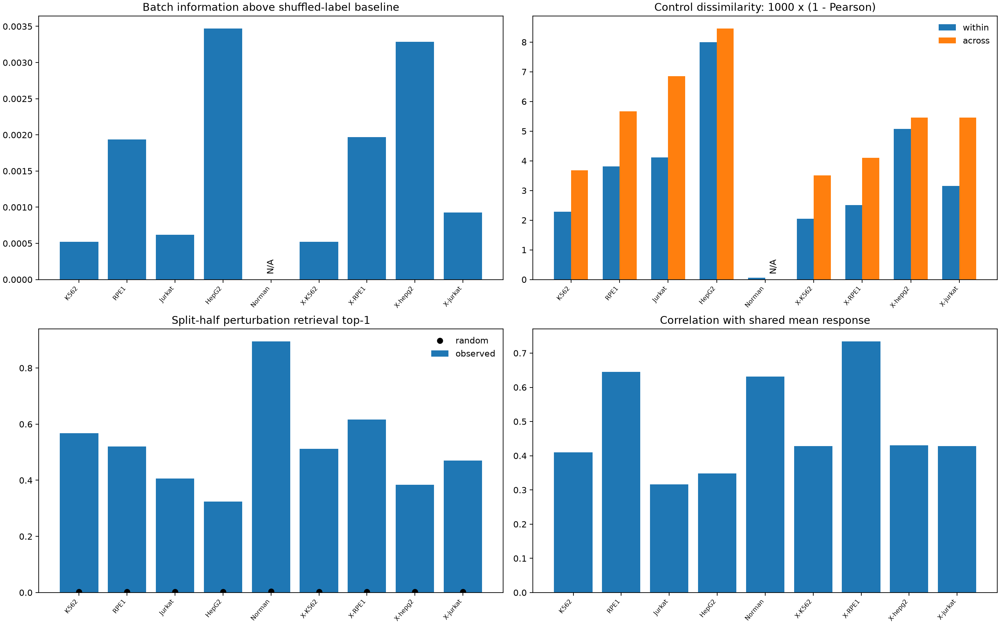
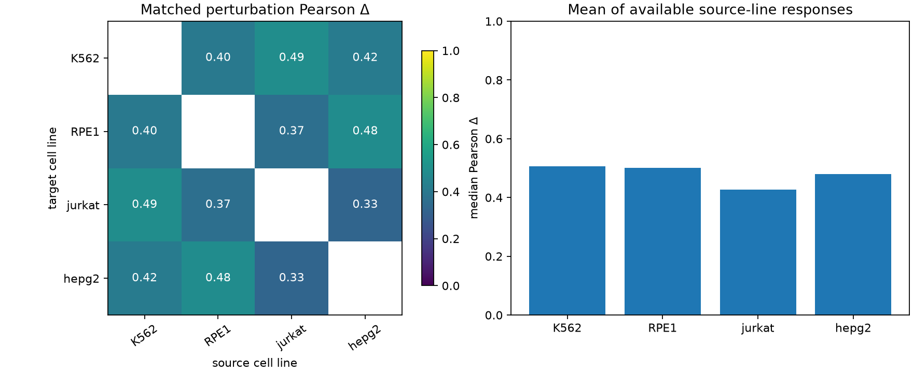

# GraD-Pert 扰动数据集观察性分析报告

**范围与结论。** 本报告只分析真实观测数据：五个独立的细胞内基准数据集，以及另列的四细胞系固定基因轴 cross-cell 缓存。没有使用 GraD-Pert 或其他模型的预测，也没有据此选择超参数或检查点。主要发现是：扰动效应的重复性、每条件细胞数和批次内可比性差异很大；大多数数据集含有明显的共同扰动方向；跨细胞系保留了部分方向相似性，但效应幅度并不相同。由此，单一相关系数不足以描述数据难度。

## 数据与比较口径

五个基准分别是 Replogle K562、Replogle RPE1、Nadig Jurkat、Nadig HepG2 的未见过单基因扰动，以及 Norman 的已见单基因组成的双基因扰动。前四个基准使用各自冻结的 5,000 个表达基因；Norman 使用 5,045 个。另行分析的 cross-cell 缓存包含 K562、RPE1、Jurkat、HepG2，统一为 **K562 来源选择的 3,352 基因轴**。它不是四个独立基准的拼接，也不是 TxPert 论文四折分别重选高变基因的精确复现。主表中的五数据集数字均来自当前 `/data/yilangliu/GraD-Pert/data`：EDA、景观、Systema 参照审计、效应图谱及分布审计使用的 canonical H5AD 哈希已逐一核对一致。涉及测试条件真值的统计只用于描述数据，不参与模型选择。

| 独立数据集 | 细胞数 | 非 control 条件数 | 每条件细胞数中位数 | 条件效应拆半 Pearson Δ 中位数¹ | 拆半 Top-1 检索² |
| --- | ---: | ---: | ---: | ---: | ---: |
| Replogle K562 | 161,662 | 1,092 | 114 | 0.621 | 56.8% |
| Replogle RPE1 | 230,244 | 2,393 | 66 | 0.604 | 52.0% |
| Nadig Jurkat | 238,977 | 2,392 | 75 | 0.326 | 40.6% |
| Nadig HepG2 | 130,879 | 2,393 | 40 | 0.273 | 32.4% |
| Norman | 91,205 | 236（105 单、131 双） | 294 | 0.928 | 89.4% |

¹ 效应拆半使用同一条件的两组细胞均值，各减去同一细胞系的 control 均值；表中为全部合格条件的中位数。² 从至多 500 个、每个至少有 20 个细胞的条件中，用一半效应检索另一半；Norman 用全部 236 个合格条件。两列来自不同审计的固定口径，不是模型分数。跨数据集表达轴、实验方案和条件组成不同，数值不能直接排成模型“难度榜”。[TxPert](https://www.nature.com/articles/s41587-026-03113-4) 将实验拆半作为参照，同时明确它不是性能上界。

五数据集 EDA 还按 **control／单基因／双基因**、划分和批次分别绘制 PCA/UMAP。当前数据版本的冻结测试条件拆半中，完整表达的相关中位数达 0.981–0.998，而 control 扣除后的效应相关中位数仅为 0.387–0.944；这说明完整表达的高相关很大程度上可能来自共同的基础表达。该图是结构探索，不把 UMAP 距离当作扰动预测准确率。EDA 与上表的拆半数值不同，是因为前者只取测试条件、按批次拆分并重复五次，后者汇总全部合格条件。详见 [EDA 口径](FIVE_DATASET_EDA.md)；[早期景观结果记录](SIX_DATASET_LANDSCAPE_RESULTS.md)属于旧 `data-vnext-a942114` 数据版本，本文数值使用当前版本复跑收据。

固定轴 cross-cell 缓存总计 **632,488 个细胞**；下表只列四折所用的四个细胞系（共 581,172 个细胞），排除缓存中另外 51,316 个 `K562_adamson` 细胞，始终与上面的五个独立数据集分栏解释。

| 固定轴细胞系 | 细胞数 | 非 control 条件数 | 每条件细胞数中位数 | 效应拆半 Pearson Δ 中位数 | 拆半 Top-1 检索 |
| --- | ---: | ---: | ---: | ---: | ---: |
| K562 | 161,662 | 1,092 | 114 | 0.612 | 51.2% |
| RPE1 | 162,625 | 1,543 | 66 | 0.724 | 61.6% |
| Jurkat | 156,881 | 1,491 | 74 | 0.483 | 47.0% |
| HepG2 | 100,004 | 1,653 | 44 | 0.380 | 38.4% |

## 效应强弱、共享方向与稳定性

将每个条件的观测均值减去本细胞系 control 均值后，仍需区分共同方向与条件特异方向。按条件平均的共同效应与单个条件效应的平均余弦，在五个独立数据集中依次为 **0.395、0.525、0.290、0.332、0.548**（顺序同上表）。尤其 RPE1 和 Norman 的共同方向较强。这与 [Systema](https://www.nature.com/articles/s41587-025-02777-8) 强调的系统性变化风险相符；这里是我们自己的描述性统计，不能把共同方向直接归因为选择偏差或某一生物机制。

在先前冻结测试条件的审计中，对同一个“训练条件平均效应”的常数基线，只把评估参照从 control 改为**训练扰动条件的平均中心**，Pearson Δ 中位数便从 K562 0.416→−0.075、RPE1 0.665→−0.050、Jurkat 0.335→0.091、HepG2 0.368→0.057、Norman 0.619→0.134。预测本身没有改变；大幅变化来自评估参照。这是评价指标敏感性的诊断，不是 GraD-Pert 的成绩，也不等同于完全照搬 Systema 的处理流程。[原审计及定义](LITERATURE_GUIDED_DATA_AUDIT_RESULTS.md)。

效应稳定性也取决于统计对象。在至多 500 个条件的效应矩阵上计算的有效秩约为 K562 **55.1**、RPE1 **42.4**、Jurkat **102.1**、HepG2 **65.9**、Norman **17.7**；这是受基因轴、条件抽样和效应噪声影响的描述量，不能解释成独立生物通路的个数。两半各自绝对效应最大的 20 个基因，其集合 Jaccard 中位数分别为 **0.379、0.379、0.176、0.176、0.600**。Nadig 两系的头部基因选择尤其不稳定。先前按细胞数分层的测试集审计中，K562 的 20–49 细胞组拆半 Pearson Δ 中位数为 0.447，≥100 细胞组为 0.763；HepG2 分别为 0.213 和 0.684。分层是观察性关联，不能把这两个差值解释为增加细胞数的因果收益。

## 批次匹配、细胞分布与 guide 证据

批次与扰动标签的原始关联指标在四个单基因数据集为 0.049–0.137；扣除随机置换的有限样本基线后，超额关联只有 K562 **0.0005**、RPE1 **0.0019**、Jurkat **0.0006**、HepG2 **0.0035**。但跨批次 control 轮廓通常比同批次 control 更不相似，因而“标签关联弱”不等于“批次效应不存在”。Norman 的 canonical 批次元数据只有一档，无法作跨批次比较。

图 1｜`X-` 前缀指固定轴 cross-cell 缓存，与左侧五个独立数据集区分；右上角的 control 差异为 `1000 × (1 − Pearson)`。底部检索与共同反应图分别反映条件可区分性和共享方向，不能被解释为模型精度。

本次新增的严格匹配审计对每个条件只选一个批次，并要求该批次中扰动与 control **各至少 20 个细胞**。满足要求的条件数如下；这比条件总体细胞数更加限制可识别的分布差异。

| 数据来源 | 同批次合格条件／全部条件 | 审计中的解释 |
| --- | ---: | --- |
| Replogle K562 | 8／1,092 | 可作少数条件的批次内对照，无法代表全数据集 |
| Replogle RPE1 | 20／2,393 | 同上 |
| Nadig Jurkat | 20／2,392 | 同上 |
| Nadig HepG2 | 3／2,393 | 覆盖尤其不足 |
| Norman | 236／236 | 单批次元数据；按细胞数分层抽取 120 个条件 |
| Cross-cell K562／RPE1／Jurkat／HepG2 | 8／1,092；18／1,543；15／1,491；2／1,653 | 与独立基准分开统计，覆盖同样受限 |

在匹配样本上，审计使用完整表达轴的固定 96 维高斯随机投影、两组各至多 40 个细胞的无偏 energy statistic、99 次**批次内标签置换**和所选条件内的 BH 校正。这是有界的分布诊断，不是 [scPerturb](https://www.nature.com/articles/s41592-023-02144-y) 官方 E-test 的精确复现；每条细胞系的投影不同，energy 值也不能跨细胞系直接比较。Norman 的 120 个分层抽样条件中，111 个（92.5%）在该样本内达到 q<0.1。其他单基因数据集的合格条件过少，不报告显著比例作为全数据集结论。Norman 的等细胞数拆半效应相关（投影空间）在每半 10、20、40 个细胞时依次为 **0.328、0.525、0.687**；这是同一抽样池内的描述性饱和曲线，不宜推断为通用的样本量需求。

guide 身份只在 Replogle RPE1、Nadig Jurkat、Nadig HepG2 的当前 canonical H5AD 中可审计。要求同条件每个 guide 至少 10 个细胞后，独立 guide 对的效应相关中位数分别为 **0.082、0.054、0.028**，对应 169、169、146 对。它们提示 guide 级一致性不能由条件级拆半替代；但 guide 与批次、目标效率可能混杂，不能直接把低相关解释为纯技术噪声。K562 和 Norman 的这份 canonical H5AD 没有可用的 guide ID，故不伪造 guide 结果。细胞不是独立的生物重复；相关统计不能代替重复实验层面的不确定性分析。[Replogle 等](https://pmc.ncbi.nlm.nih.gov/articles/9380471/)描述了 Perturb-seq 的 guide 记录，[单细胞差异表达研究](https://www.nature.com/articles/s41467-021-25960-2)说明重复层级的重要性。

## 基因程序、跨细胞系和双基因结构

以 [Enrichr GO Biological Process 2023](https://maayanlab.cloud/Enrichr/) 中预先指定的八个 GO 项作基因集合，计算每条件集合内表达均值的相对 control 变化。这是**程序级描述性汇总**，没有逐条件富集检验或因果归因。四个单基因数据集的 DNA replication 与 G2/M 程序共同均值变化均为负；K562 与 Jurkat 的 translation／ribosome biogenesis 共同变化也为负。不过集合覆盖度随基因面板变化，例如 Norman 的 DNA replication 仅覆盖 4 个基因、G2/M 仅 7 个，这两项被标记为不可解释，不与其他数据集比较。

固定轴 cross-cell 四系共有扰动并不能保证同样大小的效应。两两观测效应的 Pearson Δ 中位数跨配对约 **0.327–0.491**，但 RPE1 相对 K562 的共享条件效应范数比中位数为 **1.86**（848 个共享条件），反向比值为 0.54。先前以其余来源细胞系的同名扰动均值作为描述性参照，对留出细胞系观测效应所得 Pearson Δ 中位数为 K562 **0.507**、RPE1 **0.501**、Jurkat **0.427**、HepG2 **0.480**。这些统计使用了目标真值来度量相似性，是迁移难度的背景，**不是**留一训练模型的成绩；总体 control 扣除仍可能受批次差异影响。

图 2｜左图是两细胞系共享扰动的观测效应相关中位数；右图用其他细胞系可用的同名扰动观测均值作参照。图中没有训练跨细胞模型。

Norman 的 131 个双基因条件均找到相应两个单基因条件。双扰动观测效应与两个单扰动效应之和的 Pearson 中位数为 **0.923**，但单位系数可加预测的相对 L2 残差中位数仍为 **0.447**。允许两个单扰动效应各自拟合系数后，系数中位数为 **0.843／0.810**，残差中位数降为 **0.364**；两半独立拟合残差的相关中位数为 **0.449**。所以数据同时含可加结构和可重复的非加性部分，但尚不能给具体基因对贴上协同、抑制或上位性标签。[Norman 原研究](https://pmc.ncbi.nlm.nih.gov/articles/PMC6746554/)与[GEARS](https://www.nature.com/articles/s41587-023-01905-6)给出了进一步研究遗传互作的背景。

## 对后续分析的含义与边界

后续若分析**模型**，应在预先冻结的测试协议下并列报告完整表达、control 扣除效应、以训练扰动中心为参照的特异效应、条件检索，以及按细胞数／批次覆盖度分层的置信信息。这里提出的是评估设计依据，不代表已经运行这些模型分析。四系跨细胞任务必须明确固定轴还是论文式各折重选基因；五个独立基准也不能被 cross-cell 缓存替换。对双基因效应应同时呈现可加部分和残差。

尚未完成、也不能从当前 canonical 输入可靠推出的项目包括：TxPert 从**原始计数**拟合多项分布再独立重采样的第二种重复性估计；对全部条件有代表性的批次内 E-test；真实生物重复一致性；全数据集 guide 效率与 target knockdown 验证；单细胞个体因果效应；基于扰动筛选校正的 GO 富集。当前四个单基因 canonical 矩阵的 `X` 为处理后表达，只有 Norman 暴露 `counts` 层；即使个别上游文件可能含原始计数，也不能把在 log 表达上 bootstrap 当作 TxPert 的采样估计。UMAP 和上述相关、检索、投影检验均为观察性证据，不能推断因果机制。

## 可复核记录

- 五数据集 EDA 当前复跑：源码 `ecdf8f14a11fde63f6f4cdaecda7c9456c3e96ee`，服务器清单 `/data/yilangliu/GraD-Pert/development/five-eda-current-ecdf8f1/manifest.json`，SHA256 `1bced6d2cf02eb564ffa25d167218ef6c65f07ab403a6ebacee02635cdab5f74`；方法见 [FIVE_DATASET_EDA.md](FIVE_DATASET_EDA.md)。
- 六数据集景观当前复跑：同一源码，服务器收据 `/data/yilangliu/GraD-Pert/development/six-landscape-current-ecdf8f1/receipt.json`，SHA256 `c8add3b10259cf05a84b87c5e078674ccab24a9b8b5394627b1bd555d1d9402b`。旧版结果记录 [SIX_DATASET_LANDSCAPE_RESULTS.md](SIX_DATASET_LANDSCAPE_RESULTS.md) 使用 `data-vnext-a942114`，不是本文主表的数据版本。
- Systema 启发的参照审计：源码 `c25fa0a4be1033d304b4e6bd927a686e883d167a`，服务器收据 `/data/yilangliu/GraD-Pert/development/systema-audit-c25fa0a/receipt.json`，见 [结果记录](LITERATURE_GUIDED_DATA_AUDIT_RESULTS.md)。
- 条件效应、GO、guide、互作与跨细胞审计：源码 `f7d58a27bc877d5904ba5500cff446aea187e03b`，服务器收据 `/data/yilangliu/GraD-Pert/development/dataset-effect-atlas-f7d58a2/receipt.json`，收据 SHA256 `cbc52160f1129c11db5221357db1bf36d9cf890b196160c8e6a103b5577b607d`。早期 `69aedc5` 结果的 Norman 单条件解析错误，已由该版本修复，不用于本报告。
- 批次匹配分布审计：源码 `ecdf8f14a11fde63f6f4cdaecda7c9456c3e96ee`，服务器收据 `/data/yilangliu/GraD-Pert/development/dataset-distribution-ecdf8f1/receipt.json`，收据 SHA256 `c4fcb226055eb997f613902d56af7a420a5ce30b8fef8bea2d2deefb34c310a6`。两项新增审计都以 `seed=42`、低优先级 CPU、每类 2 个数值线程运行；结果目录只含聚合统计和收据，原始矩阵留在服务器。

所有数值都是这批冻结数据与上述具体代码口径的结果。不同来源、细胞数、基因面板及预处理足以改变数值；论文链接用于说明分析动机和方法背景，并不表示复现了对应论文的全部流程。
